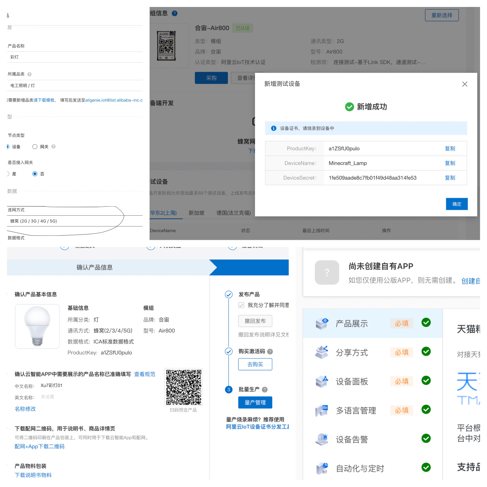
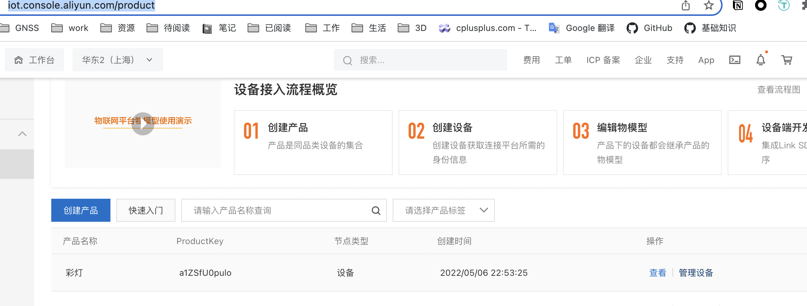
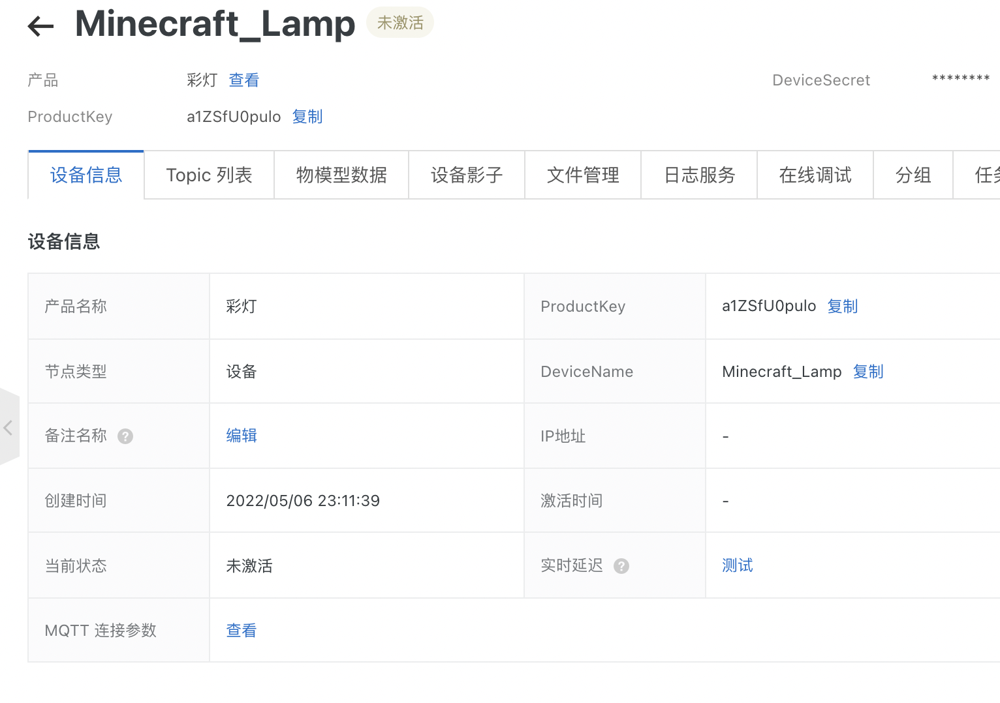
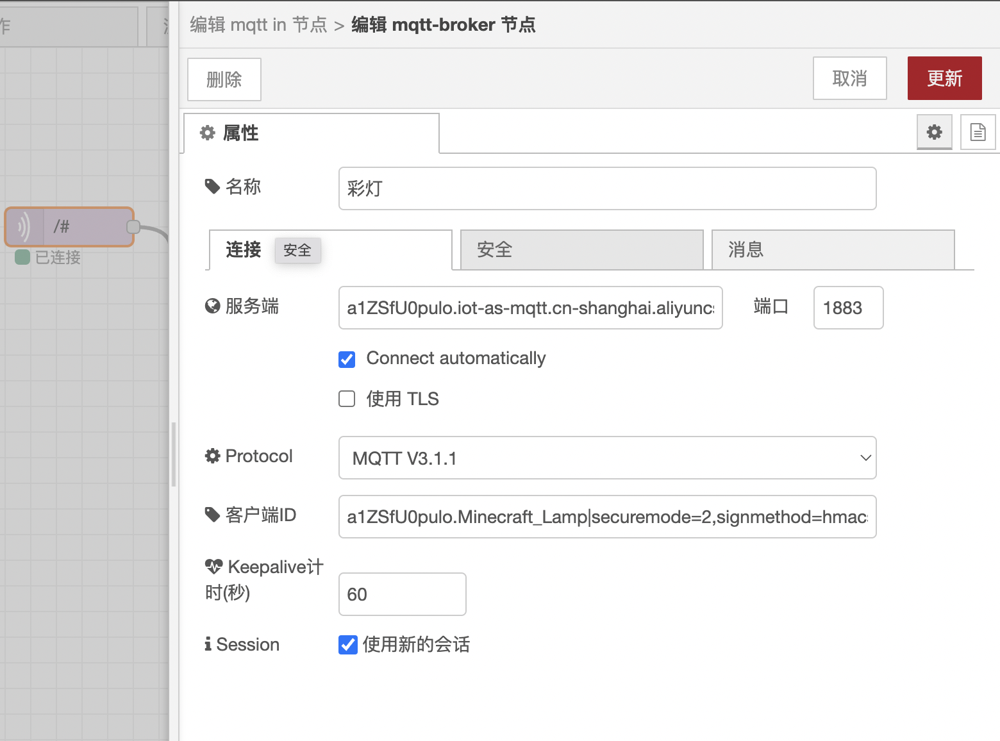
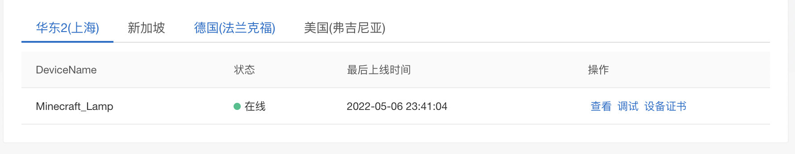
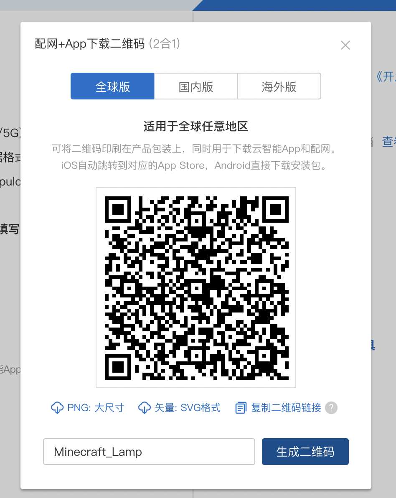
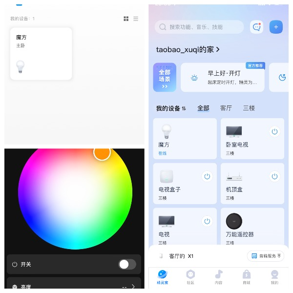
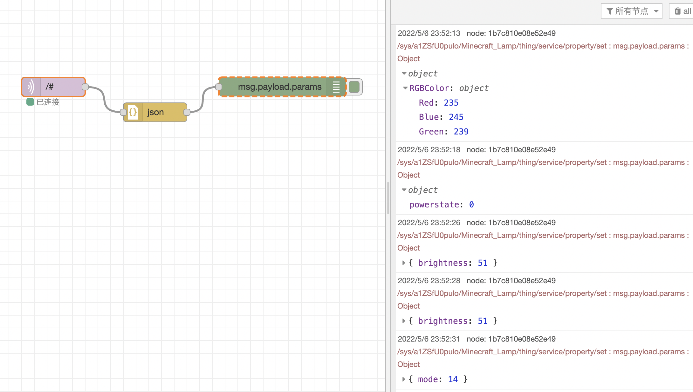
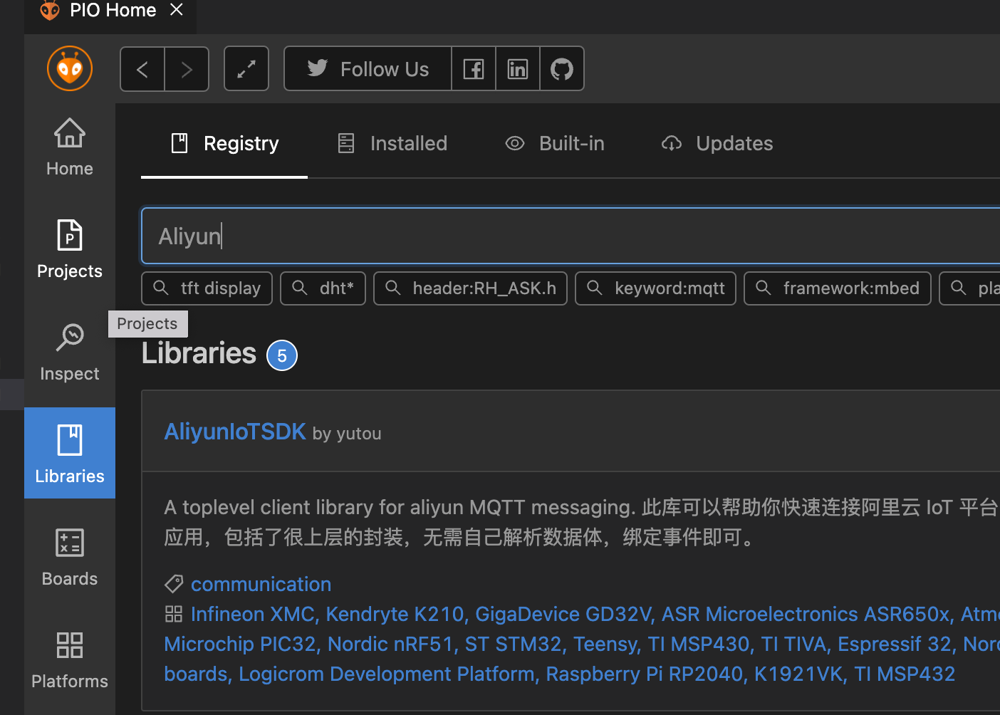
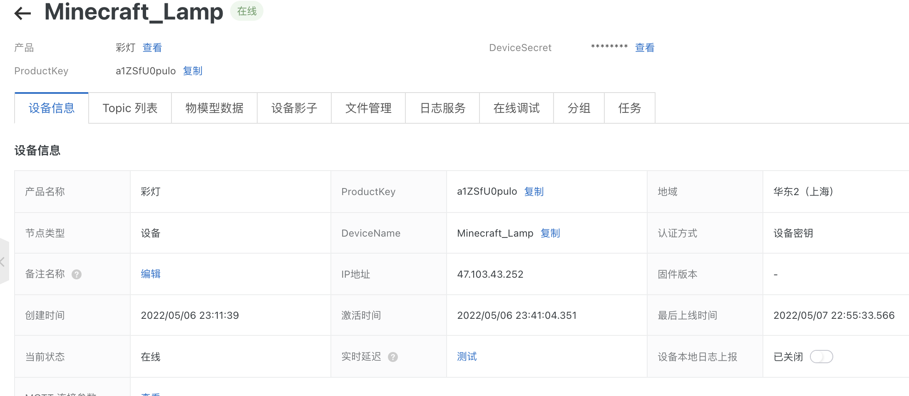

## Minecraft_Lamp
### 创建一个产品和测试设备

1. 登陆阿里生活物联网平台 https://living.aliyun.com/?spm=5176.cnlivinglink.0.0.50f74b788dGQbA

2. 创建一个新产品名叫彩灯，并为产品中加一个测试设备名字叫做Minecraft_Lamp
   + 产品的联网方式，使用蜂窝，这样可以省去配网的功能
   + 产品使用的模组，可以选择任意的带蜂窝的模组
   + 创建产品时，确保所有的都变绿



### 激活测试设备

1. 登陆到阿里物联网平台 https://iot.console.aliyun.com/product，点击产品的设备管理

   

2. 查看这个设备的MQTT连接参数

   

3. 使用任意MQTT broker工具代替我们的真正的灯，进行激活连接，我使用的是Nodered的MQTT broker节点

   

4. MQTT 连接成功后，就可以在阿里的控制台看到设备在线

   

### 手机APP控制设备和天猫精灵绑定

1. 在量产页面，点击配网+App下载二维码，输入我们测试的device名字，我的名字叫Minecraft_Lamp

   

2. 手机下载云智能 APP，登陆后，添加设备，二维码扫描添加，打开天猫精灵APP，可以在我的设备中找到新加的设备魔方

   

3.点击魔方的控制页面，确认Node-Red的MQTT broker能正常收到消息。



到此为止，所有天猫精灵的配置都已完成

### 使用ESP8266芯片模组进行MQTT连接

1. 下载AliyunIoTSDK，修改它的示例代码

   

   将AliyunloTSDK的示例代码复制过来，修改以下配置。

   ```
   #define PRODUCT_KEY "xxxxx"
   #define DEVICE_NAME "Device_D"
   #define DEVICE_SECRET "xxxxxxxxxxx"
   #define REGION_ID "cn-shanghai"
   
   #define WIFI_SSID "xxxxxx"
   #define WIFI_PASSWD "xxxxxxxx"
   ```



2. 修改AliyunIoTSDK的代码,由于原作者的代码不适用，需要修改，修改后的代码参照https://github.com/xuqi1987/arduino-aliyun-iot-sdk

   > 关于Aliyun的MQTT协议，可以参照以下文章：
   >
   > https://help.aliyun.com/document_detail/73742.htm?spm=a2c4g.11186623.0.0.7c53f24aBpMdPC#concept-mhv-ghm-b2b

3. 写一个简单的程序，实现控制灯

### 设置配网(连接wifi自动打开网页captive Portal)

```c++
    WiFiManager wifiManager;  
    wifiManager.setConfigPortalTimeout(WIFI_TIMEOUT);
    if (!wifiManager.autoConnect("AutoConnectAP")) 
    {
        Serial.println("failed to connect and hit timeout");
        delay(3000);
        //reset and try again, or maybe put it to deep sleep
        ESP.restart();
        delay(5000);
    }
```

