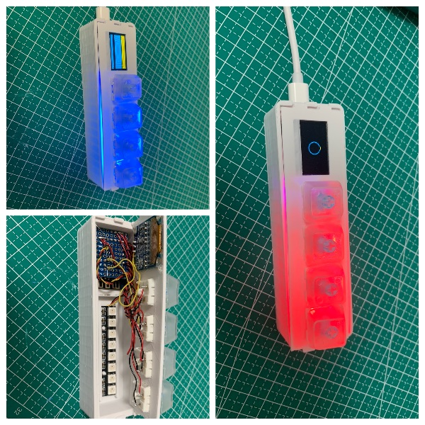

# 3D-Printer-Project
## 主要记录使用3D打印完成的项目

### QBoard项目
#### 项目功能描述
+ 有4个按键的Mini键盘，可以设置常见的快捷键

+ 键盘有RGB彩灯

+ 键盘有一个小的屏幕，可以显示一些基本信息

#### 目前进度

   

### QBoat项目
#### 项目功能描述
+ 使用T站的模型，打印一个小船，使用风力驱动 [T站链接](https://www.thingiverse.com/thing:274054)
+ 设计一个3D遥控器模型，可以控制小船前进和停止
+ 使用蜂鸟的T2和R2模块进行远距离通信

#### 目前进度

### Minecraft_Lamp项目
#### 项目功能描述
+ 参照T站模型，打印一个奥德赛的魔方灯 [T站链接](https://www.thingiverse.com/thing:4770169)
+ 魔方可以变颜色

#### 目前进度

