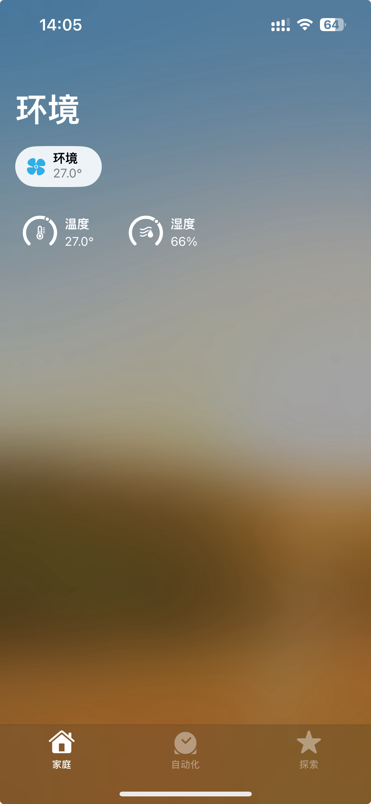

# 使用ESP8266的DHT22 HomeKit


本项目演示如何使用ESP8266（WeMos D1 Mini Lite）从DHT22传感器读取温度和湿度数据，并将其报告给Apple HomeKit。项目还利用了WiFiManager来简化WiFi设置和重新连接。

## 功能

- 从DHT22传感器读取温度和湿度数据。
- 将传感器数据报告给Apple HomeKit。
- 使用WiFiManager简化WiFi设置。
- 通过LED指示灯显示状态。

## 硬件

- [WeMos D1 Mini Lite（ESP8266）](https://item.taobao.com/item.htm?spm=a1z09.2.0.0.659b2e8dDRBRJz&id=533672579285&_u=411aik5df83b&pisk=faGK0H_0wFQKd2koI29gZHbQZ2cKeb3E7DufZuqhFcnt2qQnK8quF7nqD81kLW28wcZitk03OzwSqmM3AvqlwbnZv6fuO0A8Vqkwzk4ntaUSCDCoK2qnBaFEsvfuxHP-Pm2JmnADi2uUT7tDmeMiuPVbl_15qyN15iqd-KODi2uF-yTm5IYrDB0QczN7d7Z15lzuVMaSV51_zl1QP6a5fFUzfuN7Az6_frzlRua7ABtp2l_Qq_HSn_2E6i8NZ_cT5urZvG5uWXUKQo3CEZ_bzyeLc2Z6mLC2N8nLpfAd0yHskrUKBU6_AVcKyyH9POZIPqlqng-smmC0qiqYr9LtNTWzdPDIJ0Pvg3vFFPEDJQBPUR8aWoYOqTWzQdzTmFmVUTyOu)
- [DHT22（AM2302）温湿度传感器 ](https://buyertrade.taobao.com/trade/itemlist/list_bought_items.htm?spm=a1z02.1.leftnav.boughtitems.4ce9782dndSGTF)


## 引脚配置

- DHT22 数据引脚 -> D2
- DHT22 VCC -> 3.3V
- DHT22 GND -> GND
- DHT22 数据引脚通过10K上拉电阻连接到VCC

## 软件需求

- Visual Studio Code (VSCode)
- PlatformIO IDE 扩展
- DHT传感器库：[Adafruit DHT传感器库](https://github.com/adafruit/DHT-sensor-library)
- Adafruit统一传感器库：[Adafruit Unified Sensor库](https://github.com/adafruit/Adafruit_Sensor)
- WiFiManager库：[WiFiManager](https://github.com/tzapu/WiFiManager)
- ESP8266的HomeKit库：[arduino_homekit_server](https://github.com/Mixiaoxiao/Arduino-HomeKit-ESP8266)

## 安装

1. **安装VSCode和PlatformIO**：
   - 下载并安装[Visual Studio Code](https://code.visualstudio.com/)。
   - 打开VSCode，点击左侧扩展图标，搜索并安装PlatformIO IDE扩展。

2. **安装必要的库**：
   - 打开PlatformIO Home，点击“Libraries”。
   - 搜索并安装以下库：
     - `DHT sensor library by Adafruit`
     - `Adafruit Unified Sensor by Adafruit`
     - `WiFiManager by tzapu`

3. **克隆或下载此仓库**：
   ```sh
   git clone https://github.com/yourusername/esp8266-dht22-homekit.git
   ```

4. **打开项目**：
   - 在VSCode中，使用PlatformIO打开`esp8266-dht22-homekit`项目文件夹。

5. **配置HomeKit配件**：
   - 根据HomeKit库文档，修改`my_accessory.c`和`arduino_homekit_server.h`以配置你的HomeKit配件。

6. **上传代码**：
   - 将WeMos D1 Mini Lite连接到电脑。
   - 在PlatformIO中选择正确的开发板和端口。
   - 点击PlatformIO左下角的对勾按钮进行编译和上传。

## 使用

1. **启动你的ESP8266**：
   - ESP8266将启动并尝试连接到配置的WiFi网络。
   - 如果连接失败，它将进入AP模式，你可以连接并配置WiFi设置。

2. **检查串行监视器**：
   - 在PlatformIO中打开串行监视器以查看调试输出。
   - 你应该能看到连接状态和传感器读数的信息。

3. **HomeKit集成**：
   - 使用iOS设备上的家庭应用添加配件。
   - DHT22传感器的温度和湿度读数应显示在家庭应用中。

## 故障排除

- **温度/湿度读数不正确**：
  - 确保DHT22传感器连接正确。
  - 检查数据引脚上的上拉电阻。
  - 确保有足够的延时让传感器稳定。

- **WiFi连接问题**：
  - 确保WiFi凭据正确。
  - 将ESP8266移动到WiFi路由器更近的位置。

## 贡献

欢迎贡献！请提交issue或pull request以进行改进或修复bug。

## 许可证

本项目基于MIT许可证开源。详情见LICENSE文件。

## 致谢

- 感谢[Adafruit Industries](https://www.adafruit.com/)提供的DHT传感器库和统一传感器库。
- 感谢[tzapu](https://github.com/tzapu)提供的WiFiManager库。
- 感谢[Mixiaoxiao](https://github.com/Mixiaoxiao)提供的ESP8266的HomeKit库。

---

## 开发过程中遇到的问题
- 不能用ESP-01s，因为ESP-01 flash只有512k，放不下这套程序
- Homekit-ESP8266，不要使用HomeKit-ESP8266 by Mixiaoxiao，因为有一个base64.h和ESP8266的bash.64头文件重名了
- 遇到ESP8266mDNS.h找不到，需要添加`lib_ldf_mode = deep`
